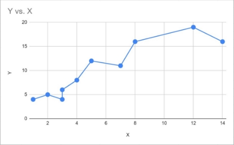

Geekbrains

|**Дипломная работа**|
| :- |
|Анализ и визуализация данных с помощью python на примере данных A/B-тестирования объявлений|

|
Выполнила:

Дядькина Анна Анатольевна

Факультет

Разработчик — Аналитик
|
| :- |

|
Калининград

2023
|
| :-: |

# **Оглавление**
[Введение	1](#_Toc133742488)

[Глава 1. Визуальный метод анализа данных	2](#_Toc133742489)

[1.1 Применение визуализации данных	2](#_Toc133742490)

[1.2 Средства визуализации данных	9](#_Toc133742491)

[Список литературы	12](#_Toc133742492)

# **Введение**
Сегодня стремительно растет количество и виды данных. У современного исследователя есть в потребность в гибких, мощных и легко масштабируемых инструментах для сбора и анализа информации. 

Рыночные условия в текущее время побуждают компании искать все более эффективные способы продвижения продукции, товаров, услуг. Реклама в интернете - один из лучших способов бизнесу заявить о себе. 

При запуске рекламной кампании сложно прогнозировать, какие объявления будут наиболее эффективны. A/B тестирование объявлений позволяет сравнить и определить наиболее перспективные из них. В ходе эксперимента собирается массив данных о конверсии, кликабельности. В ходе эксперимента собираются данные, требующие анализа для последующего выбора стратегии продвижения, увеличения конверсии и минимизации затрат на рекламу.

Цель данной работы — изучить инструменты анализа и визуализации данных с помощью библиотек python на примере тестовой базы данных, содержащей результаты A/B-теста, проведенного рекламным агентством.

Для достижения цели необходимо решить следующие задачи:

1. изучить литературу по A/B-тестированию и визуализации данных;
1. рассмотреть основные библиотеки python для анализа и визуализации данных;
1. составить анализ тестовой базы данных, содержащей результаты A/B-теста, проведенного рекламным агентством;
1. визуализировать результаты A/B-тестирования;
1. выявить закономерности в результатах тестирования и разработать предложения по настройке рекламной кампании.
# **Глава 1. Визуальный метод анализа данных**
# **1.1 Применение визуализации данных**
Визуализация данных являет собой представление данных в живописной или графической форме. На протяжении всей своей истории люди зависели от визуального представления данных, чтобы воспринимать информацию легче и быстрее (например, диаграммы, схемы, карты и многое другое). 

Визуализация данных относится к методам, используемым для передачи данных или информации с помощью их кодирования как визуальных объектов (например, точки, линии или столбцы), содержащихся в графике. Цель состоит в том, чтобы передавать информацию четко и эффективно для её пользователей. Это один из шагов в анализе данных. Это не означает, что визуализация данных должна выглядеть скучно (быть функциональной или чрезвычайно сложной), чтобы выглядеть красиво. Для эффективной передачи идеи эстетическая форма и функциональность должны идти рука об руку, обеспечивая понимание. 

Визуализация данных рассматривается многими дисциплинами как современный эквивалент визуальной коммуникации и, вместе с тем, не принадлежит какой-либо одной области, а находит применение во многих (например, она рассматривается в качестве современного направления описательной статистики, но также в качестве обоснованной теории развития инструментария в других областях). Она включает в себя создание и исследование визуального представления данных, что означает «информацию, которая была в абстрагированном схематическом виде, в том числе, для атрибутов или переменных единиц информации».

` `Эффективная визуализация помогает пользователям в анализе и обработке данных. Это делает комплексную информацию более доступной, понятной и полезной. Таблицы, как правило, используются там, где пользователи будут смотреть конкретные меры переменных, в то время как диаграммы различных типов используются, чтобы показать тренды или отношения одной или нескольких переменных. 

За последнее десятилетие произошло колоссальное увеличение объема цифровых данных, поступающих из различных источников. Системы баз данных позволяют осуществлять массовый сбор данных, которые могут быть использованы для выявления различных проблем и дают возможность прогнозирования путем выявления важных влияющих факторов. Следовательно, можно наблюдать повышенный интерес к использованию этих больших структурированных и неструктурированных наборов данных в целях повышения эффективности принятия обоснованных и аналитических решений. 

На сегодняшний момент в мире ежедневно производится 2,5 квинтиллиона байт данных, и 90 % всех данных было создано за последние два года. С таким большим количеством данных становится все труднее управлять и самое главное оперативно принимать решения. 

Визуализация может помочь людям увидеть вещи, которые не были очевидны для них прежде. Даже когда объем данных очень большой, тренды могут быть замечены быстро и легко. Визуализация помогает передать информацию универсальным образом и сделать это просто.

Визуализация данных представляет информацию таким образом, что ее можно легко интерпретировать, экономя время и энергию. Интерактивные графики и диаграммы делают восприятие более легким для лиц, принимающих решения: 

− определить области, требующие внимания или улучшение; − понимать, какие факторы влияют на поведение ваших клиентов; − знать, какие продукты где размещать;

` `− прогнозировать объемы продаж;

− узнать, как увеличить доходы или сократить расходы и др.

До недавнего времени визуальный анализ данных для отображения результатов на обычных мониторах использовал только двумерную или очень простую трехмерную графику. Более сложные графические образы отображать в реальном времени было достаточно сложно и дорого. Однако прогресс в области аппаратных средств вывода изображений способствовал и совершенствованию средств визуального анализа данных. В настоящее время существует достаточно большое количество различных видов графических образов, позволяющих представлять результаты анализа в виде, удобном для понимания человеком.

` `С помощью новых технологий пользователи способны оценивать: большие объекты или маленькие, далеко они находятся или близко. Пользователь в реальном времени может двигаться вокруг объектов или кластеров объектов и рассматривать их со всех сторон. Это позволяет использовать для анализа естественные человеческие перцепционные навыки в обнаружении неопределенных образцов в визуальном трехмерном представлении данных.

Визуальный анализ данных особенно полезен, когда о самих данных мало известно и цели исследования до конца непонятны. За счет того, что пользователь напрямую работает с данными, представленными в виде визуальных образов, которые он может рассматривать с разных сторон и под любыми углами зрения, в прямом смысле этого слова, он может получить дополнительную информацию, которая поможет ему более четко сформулировать цели исследования. 

Таким образом, визуальный анализ данных можно представить как процесс генерации гипотез. При этом сгенерированные гипотезы можно проверить или автоматическими средствами (методами статистического анализа или методами Data Mining), или средствами визуального анализа. Кроме того, прямое вовлечение пользователя в визуальный анализ имеет два основных преимущества перед автоматическими методами: 

а) визуальный анализ данных позволяет легко работать с неоднородными и зашумленными данными, в то время как не все автоматические методы могут работать с такими данными и давать удовлетворительные результаты; 

б) визуальный анализ данных интуитивно понятен и не требует сложных математических или статистических алгоритмов.

Визуальный анализ данных обычно выполняется в три этапа:

` `а) беглый анализ — позволяет идентифицировать интересные шаблоны и сфокусироваться на одном или нескольких из них; 

б) увеличение и фильтрация — идентифицированные на предыдущем этапе шаблоны отфильтровываются и рассматриваются в большем масштабе; 

в) детализация по необходимости — если пользователю нужно получить дополнительную информацию, он может визуализировать более детальные данные.

Визуализацию данных можно представить как один из шагов анализа данных с целью сделать предсказания на основе математической модели.

Рисунок 1 - Схема визуального анализа данных

Аналитики применяют более 60 видов визуализации: различные диаграммы, графики, дашборды и карты. Рассмотрим самые популярные методы визуализации. 

1. Диаграммы. Эти средства визуализации информации насчитывают десятки видов. Диаграмму следует выбирать исходя из типа данных, целей и вида анализа.

Виды диаграмм:

- Круговая диаграмма. Идеально подходит для показа частей целого.  Но если показателей больше пяти, исчезает наглядность. 

Круговая диаграмма имеет и иные формы, которые помогают лучше решить задачу. Хорошо использовать диаграмму-пончик, поскольку человек проще ориентируется на длину окружности, нежели на площадь, и видит разницу сразу. Многоуровневые диаграммы подходят для показа иерархии и связь между категориями.

- Столбчатая диаграмма более подходит для точного сравнения категорий, когда количество показателей выше пяти. Используется для того, чтобы отображать рейтинг, т.е. представить лучшие и худшие параметры по отношению друг к другу. К этому виду визуализации относятся и гистограммы.
- Географическая диаграмма для представления данных, связанных с географическим положением объектов.
- Пузырьковая диаграмма нужна, когда важно отобразить соотношение различных показателей.

Рисунок 3 - Примеры диаграмм

1. График — это множество точек, расположенных по оси X и Y, соединенные линией. Используется для отображения динамики изменения показателя в течение времени. Это самый обычный и весьма наглядный вид визуализации, поэтому неизменно пользуется популярностью и широко применяется.

Рисунок 4 - Пример графика

1. Линейный график. Наиболее понятный вид динамики — это одна или несколько линей. Каждая характеризуется одним показателем, изменяющимся по параметру оси X. 

Рисунок 5 - Пример линейного графика

1. Таблица и матрица. Для сжатия и упрощения информации необходимо, чтобы в таблицах содержалось ограниченное количество строк и столбцов. Таблица является двумерным массивом данных, т.е. на пересечении строки и столбца есть совокупность параметров. Матрица тоже представляет собой таблицу, но она более расширена, поскольку может включать группы строк и/или столбцов.
# **1.2 Средства визуализации данных**  
Выбор правильного инструмента для визуализации данных часто зависит от типа данных и уровня знания пользователем языков кодирования, так как многие инструменты специализированы для работы с определенными форматами данных. Рассмотрим некоторые из них: 

1. Tableau — это система, позволяющая провести глубокий и разносторонний анализ информации с последующим представлением результатов в интерактивной форме. При этом это очень гибкая, быстрая и простая в освоении платформа.
1. Microsoft Power BI - набор инструментов бизнес-аналитики, которые позволяют анализировать и наглядно представлять ценную информацию. Благодаря сервису, можно использовать сторонние приложения и множество источников информации.  С его помощью можно создавать кастомизированные визуализации. 
1. Онлайн-сервис Flourish создаёт красивые визуализации данных, чтобы наглядно показать не только цифры, но и аналитику. Инструмент подключает анимацию и создаёт data storytelling. 
1. Устройство для захвата данных Datawrapper – это онлайн-платформа для создания PNG-диаграмм и карт без необходимости кодирования. Он был разработан специально для писателей, журналистов, блогеров.
1. Plotly – это полностью веб-интерфейс для создания графики. Он не требует каких-либо знаний кодирования. С его помощью аналитики создают интерактивные графики, дашборды, карты. Всем проектам Plotly присваивается уникальный URL — их легко встраивать в блоги. Графики получаются очень детальными и подробными. В библиотеке хранится много уникальных диаграмм. 
1. ` `Excel является эффективным и универсальным средством для любой аналитической задачи. Excel можно объединить ее с Power BI для получения широких возможностей аналитики и визуализации данных.
1. ` `В Python визуализация данных легко осуществляется с использованием сторонних пакетов. Чаще всего используют библиотеки Matplotlib, Bokeh, pygal, seaborn.

Выбирая те или иные инструменты для визуализации данных, нужно учитывать их плюсы и минусы. Недостатками сервисов могут быть: ограниченный функционал бесплатных версий, невозможность использования всей компанией, плохая защищенность данных, сложности с импортом и обработкой больших объемов данных, высокий порог вхождения для аналитика.

Язык python стал популярен среди специалистов в области data science. Это один из самых простых языков для изучения. Он предлагает множество библиотек, которые применяются на всех этапах анализа данных. С помощью python можно анализировать очень большие массивы данных – нет ограничений по их объему.

Python подходит для следующих задач:

1. ` `сбор данных;
1. обработка данных, построение моделей;
1. визуализация данных.

Выделим некоторые преимущества python для анализа и визуализации данных:

1. Широкое сообщество, помогающее найти решение для поставленной задачи.
1. Постой синтаксис и читаемость. 
1. Разнообразие библиотек для разных этапов анализа данных.
1. Гибкость и масштабируемость, благодаря чему используется в самых разных отраслях.
1. Регулярные обновления.

Минусами использования можно считать медленную обработку данных и плохая развитость работы с базами данных.

# **Список литературы**
Антошина Т. Н. Применение визуализации данных в автоматизированных информационных системах [Статья]. - Санкт-Петербург : [б.н.], 2020 г.. - Т. с. 4.

Беляев Н. А. Визуализация данных: инфографика как инструмент маркетинга [Статья]. - Челябинск : [б.н.], 2015 г.. - Вестник ЮУрГУ. Серия «Экономика и менеджмент». - Т. 9, с. 5.

Визуализация данных — что это: виды, способы и средства визуального представления информации [В Интернете] // Блог Алексея Колоколова. - https://alexkolokolov.com/ru/blog/vizualizaciya-dannyh-chto-eto.

Визуализация данных: применение в работе, основные принципы, способы и инструменты для использования [В Интернете] // Яндекс Практикум. - https://practicum.yandex.ru/blog/vizualizaciya-dannyh/#id4.

Захаров Л.И. Сбор и визуальный анализ больших объемов данных, с помощью инструментов python и power bi.. - Казань, с. 30 : [б.н.], 2018 г..

Как и зачем использовать Python для анализа данных [В Интернете] // pythonru. - https://pythonru.com/baza-znanij/python-dlya-analiza-dannyh.

Н. Антошина Т. Применение визуализации данных в автоматизированных информационных системах [Статья]. - Санкт-Петербург : [б.н.], 2020 г.. - Т. с. 4.

Процесс анализа данных [В Интернете] // https://pythonru.com/. - https://pythonru.com/baza-znanij/process-analiza-dannyh.

Фетисова М. С. Информационно-аналитическая система поддержки принятия решений в области рекламы. - Барнаул, с. 68 : [б.н.], 2019 г..

